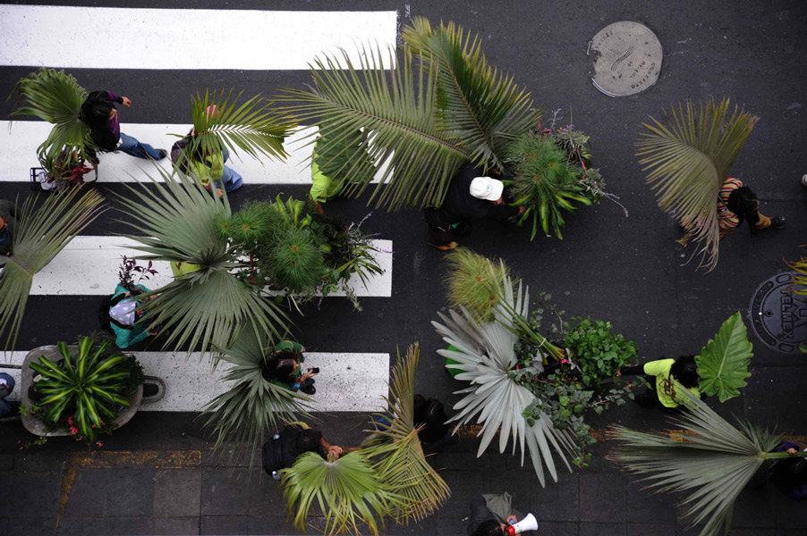
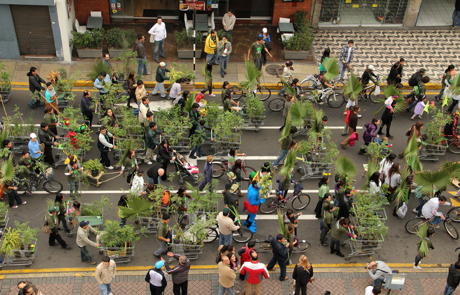

# Lucia Monge

[Contact](#contact), [CV](#cv)

## News

- Brian House is dope!
- I started the year on the amazing arts & ecology residence at Guapamacátaro *(January)*{: .exhibition }
- The second issue of Global Performance Studies came out this month and included a multimedia essay on Plantón Móvil that I wrote. This is my first peer-reviewed journal contribution so I am happy about this! (January)
- I am going to lead a workshop at Ruderal Ecologies: Grounds for Change– A Symposium Entangling Art, Ecology and Environmental Justice at The Sanctuary for Independent Media in North Troy, NY (April 13-15)
- I will be presenting at Open Engagement . The conference is dedicated this year to sustainability and includes Lucy Lippard and Mel Chin as keynote presenters. (May)
- This year’s Plantón Móvil will take place in London and includes a special group of humans! More soon… (June)
- I am back thinking about water and I am currently working on a project for an upcoming exhibition in Johannesburg: Watershed. This exhibition is part of a conference taking place at the University of Witwatersrand and Brown University. My research will be informed by the Centre for Water Research and Development. (September)

## Works

### _[Nos]Otros / [Our]Others_

    

    

2015, 2016  

Nosotros is the word in Spanish for us or we. I like to break it down to nos + otros, something similar to our + others. [Nos]otros then stands for our others; it is the extended community that recognizes other living forms as part of our own kin[d]. Finding balance in and with our environment is a continuous negotiation, an everyday practice. Helping this group of limbs stand alludes to that practice.
{: .en }

This project has been exhibited in RISD’s graduation thesis show in Providence, RI and in Flux Factory, Long Island, NY. In 2016 it was recreated in collaboration with a group of participants at Bosse & Baum in Peckham, London.
{: .en }

/

El título de esta pieza alude al reconocimiento de otras formas de vida como parte de nuestra comunidad extendida. Encontrar un balance en y con nuestro medio ambiente es una negociación constante, una práctica diaria. Lograr que este grupo de ramas se pare alude a esa práctica de búsqueda de equilibrio. 
{: .es }

Photos/Fotos: by Forrest Kelley, Damian Griffiths and Eugenia Ivanissevich

### _Plantón Móvil_

2015, 2016, 2020

¿Cómo sería encontrarse un bosque móvil circulando entre el tráfico, los edificios y la gente apurada?
{: .es }

Todos los días crece el cemento y disminuye el verde. Los árboles, arbustos, flores y demás plantas de nuestra ciudad quedan irremediablemente en algún rincón de la ciudad: casi invisibles y totalmente inmóviles. Son arrimados, asfixiados y hasta convertidos en basurero. Es entonces como un pequeño grupo de plantas se junta y sale a circular entre los micros y combis de Lima. Un pequeño bosque que sale pacíficamente a marchar por su lugar en la ciudad.
{: .es }

Cada participante elige la forma de transportar su verde, utilizando carretillas, mochilas, bicicletas, skates, las manos y cabezas, en fin cualquier medio no contaminante. Pero no somos un grupo de personas cargando plantas, aunque sea por ese momento yo soy ese Molle, tú esa Bougainvillea, SOMOS BOSQUE
{: .es }

Al final de cada recorrido un grupo de las plantas recorridas sirven para crear una área verde en el espacio público.
{: .es }

[http://www.plantonmovil.org](http://www.plantonmovil.org)

/

“Plantón” is the word in Spanish for a sapling. It is also the word for a sit-in. This project takes on both: the green to be planted and the peaceful protest. It is about giving plants and trees the opportunity to walk down the streets of their city. At the end of each walk, we co-create community public green areas.
{: .en }

I have organized “walking forest” performances annually since 2010. Plantón Móvil is about moving-with as a form of solidarity. I began thinking humans were lending their mobility to plants—now I understand that we gain much from borrowing their slowness as well. We learn in our attempt to find common speed.
{: .en }

More on Plantón Móvil on the project’s website: [http://www.plantonmovil.org](http://www.plantonmovil.org)
{: .en }

### _Prostheticos_

___
## CV

CV

## Contact

lucia [at] plantonmovil [dot] org
