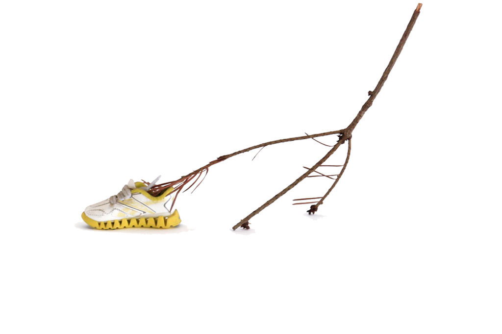

# LUCIA MONGE

##### [Works](#works), [Bio](#bio), [Contacto](#contacto)

## News

#### Current | Upcoming
• Artist talk at “Contesting Spaces: Art, Ecologies, Activism” course, Smith College, Oct 29  
• Artist talk at "Art & Ecology: Materials Matter" course, Lewis & CLark College, Oct 22  
• [Plantón Móvil at the Queens Museum and in collaboration with local communities](https://queensmuseum.org/events/planton-movil) Queens Museum, Oct 12th 2-5pm    
• [Biomateriales: cocinando alternativas](https://espacio.fundaciontelefonica.com.pe/evento/biomateriales-cultivando-alternativas/) (taller) Espacio Fundación Telefónica, Lima, 25-28 de setiembre   
• [Plantón Móvil: Plant+Human Connectors](https://queensmuseum.org/events/planton-movil-workshop-ii) (workshop) Queens Museum, Aug 15th 2-5pm    
• [Plantón Móvil: Introduction to Plants and Plant Movement](https://queensmuseum.org/events/planton-movil-workshop-i) (workshop) Queens Museum, Aug 8th 2-5pm        
• [Fruiting Bodies:Experiments in Fungal Inoculation and Mycoremediation](https://www.eventbrite.com/e/fruiting-bodies-experiments-in-fungal-inoculation-and-mycoremediation-tickets-63402116437) (workshop with Chris Kennedy and Chloe Zimmerman) Genspace, NYC July 21 y 26     
{: .news}

#### Recent 
• Re-performing Darwin (presentation with Tony Willis) Oak Spring Garden Foundation, June 5    
• [Blue Sky: Agility and the Possible in a Warming World](https://www.brown.edu/academics/institute-environment-society/agenda-2) (panel) Institute at Brown University for Environment & Society, Providence, April 10-12  
• [Grafters for Change](https://calendar.colgate.edu/event/grafters_x_change_branches_and_networks) (workshop) Colgate University, March 29-30      
• [Socrates Annual Farewell Fete](http://socratessculpturepark.org/program/the-socrates-annual-farewell-fete/) (performance) Socrates Sculpture Park, Long Island City, March 24th    
• [Conversatorio Muro: Colaboraciones y Colectividades en Proyectos Artísticos](http://espacio.fundaciontelefonica.com.pe/evento/muro-sobre-proyectos-artisticos-participativos/) (panel) Espacio Fundación Telefónica, Lima, 23 de marzo     
• Studio Foundation and 3D Foundations  which included a semester-long exploration on biomaterials with students (teaching) Visual Art Department, Brown University, 2017—May 2019   
   

## Works 

### Tools for many kinds of selves

    

    

    

    

    

    

Mixed media // 2017-ongoing

"Ways of being are emergent effects of encounters" Anna Tsing
{: .en }

I believe sculpture can be a sort of walking cane; a tool that becomes a physical manifestation of the distance between ourselves and everything around us. It represents the space in-between and, at the same time, may transfer touch serving as a conductor for contact.
{: .en }

I have been making sculptures that take on the form of speculative/prosthetic/por qué no/what-if tools meant to be used by small groups of people. These tools and the accompanying scores are influenced by mycelial thinking and invite to observe and record the thinking and action that emerge from attention to other ways of being (to each other). 
{: .en }

### Re-Performing Darwin 

    

2018-ongoing

Este proyecto comienza estudiando el libro de Charles Darwin "Movimientos y Hábitos de Plantas Trepadoras" y replicando algunos de sus experimentos para observar y registrar el movimiento de las plantas. Mis experimentos no son completamente idénticos a los suyos pero comparten a la observación como método y herramienta base. Este proyecto se enfoca en dos escalas y contextos distintos. Por un lado anota el crecimiento y revoluciones de tallos y zarcillos en plantas adentro de mi taller y por otro registra el movimiento de plantas enrrolladas con la infraestructura urbana. El primer escenario reduce variables ambientales y permite un enfoque en el movimiento espontáneo de distintas especies y de partes específicas de la planta. El segundo escenario se concentra justamente en la interacción entre el movimiento de la planta y su contexto y representa la negociación entre la planta, la ciudad y los otros seres vivos que por ahí se mueven.
Las rejas y paredes por las que estas plantas trepan son particularmente relevantes pues este movimiento de las plantas que las trepa, enrrolla y cruza en varias direcciones vuelve a estas supuestas fronteras permeables.
{: .es }

/

This (still untitled) project starts with Charles Darwin's text The Movements and Habits of Climbing Plants and replicates some of his experiments for observing and notating plant movement. Although my experiments are translations of his methods, tools, and techniques they share a base in observation. My project notes two different scales and contexts. One of my experiments marks the growth of particular shoots and tendrils in plants inside my studio and the other records the movement of plants intertwined with the urban infrastructure. The first scenario allows for a focus on the movement of specific plant parts and of the individuals themselves by reducing the amount of environmental variables. The second scenario focuses on precisely the movement that results from the changing environment and represents the negotiation between the plants, the built environment, and the other many living beings bustling on the streets.
{: .en }

The fences that these climbers creep on have a key role in this work as well. It is this specific type of movement that weaves permeability into the border.
{: .en }

### Mi niño, your dryspell, their waterfall

    

    

    

    

    

2018-ongoing

Este es un proyecto de largo plazo que investiga las estrategias de plantas desérticas para recolectar y guardar agua. Las adaptaciones morfológicas de estas plantas informan exploraciones en escultura para re-imaginar herramientas humanas con funciones similares. Observar la manera en la que las plantas enfrentan la falta de agua es un filtro para repensar la manera en la que lidiamos con el recurso en nuestra vida cotidiana. El diseño de nuestras herramientas y sistemas habla de nuestra relación con el agua.
Mi investigación ha comenzado con especies endémicas de Sudáfrica y Perú. Con el tiempo incorporará a otras especies de plantas y regiones.
{: .es }

/

Mi niño, your dry spell, their waterfall is a long-term project that looks into the ways in which desert plants collect and conserve water to re-think and re-shape human tools designed for similar tasks. It begins with plant species endemic to deserts in South Africa and Peru and will later expand to other parts of the world. These plant's morphological adaptations inform sculptural explorations that produce natural-cultural artifacts and speculative water systems. To observe how plants face the challenge of water scarcity serves as a lens to revisit the way humans handle water and organize its distribution on an everyday basis.
{: .en }

### [Nos]Otros / [Our]Others

    

    

    

    

    

Found tree limbs + second hand shoes // 2015, 2016

El título de esta pieza alude al reconocimiento de otros seres vivos como parte de nuestra comunidad. La palabra nosotros incluye a 'otros' en la unidad del 'yo'. Sugiere la presencia de lo 'otro' en los límites del 'uno' mismo y de esta manera la extensión de los bordes que comprenden lo que yo soy y de cuál es mi comunidad. Sin embargo la noción del 'nosotros' no es fija. Encontrar un balance en y con otros seres vivos y nuestro medio ambiente es una negociación constante, una práctica diaria. Buscar que este grupo de ramas recogidas por la ciudad alcancen el equilibrio suficiente para pararse alude a esa práctica.
{: .es }

/

Nosotros is the word in Spanish for us or we. If broken down into nos + otros, it reads something similar to our + others. [Nos]otros then stands for our others; as an extended community that recognizes other living forms as part of our own kin[d]. Finding balance in and with our environment is a continuous negotiation, an everyday practice. Helping this group of limbs stand alludes to that practice.

This project was exhibited in 2015 at RISD’s graduation thesis show in Providence, and at Flux Factory, NY. In 2016 it was recreated with participants at a workshop at Bosse & Baum Gallery for the exhibition Arcadia Artificial, London.
{: .en }

Fotos: Forrest Kelley, Damian Griffiths and Eugenia Ivanissevich

### Plantón Móvil

    

    

    

    

    

    

    

    

    

Plants, trees and people // 2010-ongoing  
[http://www.plantonmovil.org](http://www.plantonmovil.org)

¿Cómo sería encontrarse un bosque móvil circulando entre el tráfico, los edificios y la gente apurada?
{: .es }

Todos los días crece el cemento y disminuye el verde. Los árboles, arbustos, flores y demás plantas de nuestra ciudad quedan irremediablemente en algún rincón de la ciudad: casi invisibles y totalmente inmóviles. Son arrimados, asfixiados y hasta convertidos en basurero. Es entonces como un pequeño grupo de plantas se junta y sale a circular entre los micros y combis de Lima. Un pequeño bosque que sale pacíficamente a marchar por su lugar en la ciudad.
{: .es }

Al final de cada recorrido un grupo de las plantas recorridas sirven para crear una área verde en el espacio público.
{: .es }

/

“Plantón” is the word in Spanish for a sapling. It is also the word for a sit-in. This project takes on both: the green to be planted and the peaceful protest. It is about giving plants and trees the opportunity to walk down the streets of their city. At the end of each walk, we co-create community public green areas.
{: .en }

I have organized “walking forest” performances annually since 2010. Plantón Móvil is about moving-with as a form of solidarity. I began thinking humans were lending their mobility to plants—now I understand that we gain much from borrowing their slowness as well. We learn in our attempt to find common speed.
{: .en }

More on Plantón Móvil on the project’s website: [http://www.plantonmovil.org](http://www.plantonmovil.org)
{: .en }

Fotos: Rob Harris, Tatiana Guerrero, Brian House, Josip Curich, Eugenia Ivanissevich, Jorge Ochoa

### Body parts

    

    

    

    

    

    

    

### Arcadia Artificial

    

    

    

    

    

    

### Primer Contacto

    

    

    

    

    

Installation of plants connected to the human organ system, a drawing table with speakers and a pen attached to a contact microphone // 2013


This installation invited participants to spend some time drawing a plant in detail. Drawing requires observation and close attention. In this way the experience aimed to function as an initial contact with the chosen plant. The pen with which the drawings were made had a piezo-electric connected to it so each trace created a specific sound. The contact sounds between the pen, the paper, the observer's eye, and the plant were reproduced through speakers, recorded and later displayed next to the participants' drawings.
{: .en }

### escultura / sculpture

    

    

    

    

### drawing / dibujo

    

    

    

    

### Pañuelos de Despedida

    

    

    

    

    

    

    

    

    

    

    

    

Fabric, water-soluble and permanent markers, thread, appliqués, ribbons // 2008-2009

A goodbye necessarily establishes an ending and therefore usually implies a “letting go” that is not always easy. The same way handkerchiefs were carried in-hand during goodbyes at ports, I propose this ritualization of a farewell on a personalized handkerchief. Using water as a means of transport participants disssolve images of the past they have inscribed on their piece of cloth. Color stains and patterns emerge as a vestige of what was lived, a sort of shroud marked with the presence it held. Whether this is a happy, sad, calm or furious goodbye, we also celebrated what is carried for the future with indeleble markers and embroidery.

This project was carried out as a workshop/shared ritual in Mexico and Peru. These were held at different locations such as a museum, plazas, a home, a cultural centre and a women’s penitentiary.
{: .en }

### Mitin Gap

    

    

    

    

[experimental] Conversations between people speaking in foreign languages // 2013-2015

Participants were invited to engage in conversation with another person while each speaking in their mother tongue. They had to practice/attempt communication even thought they did not speak each other's language. Conversations were carried out in Mandarin, Spanish, French, Corean, Tibetan, and Arabic in different combinations. The dialog was revealed afterwards when the content was transcribed from the sound recordings into what was then the common ground; English. Video and sound recordings document these encounters. The frame however reveals very little of the speakers and rather centers in the space in between them.
{: .en }

## Bio

Lucia Monge is a Peruvian artist with a background in education and art + science collaboration. Her work explores the way humans position ourselves within the natural world and relate to other living beings, especially plants. For the past nine years she has organized Plantón Móvil, a yearly “walking forest” performance that leads to the creation of public green areas. This year it was organized in collaboration with the Queens Museum, NYC Parks, John Bowne Highschool and local community groups and supported by Citywide Nursery and the Queens Botanical Garden.  
{: .en }

Monge has exhibited widely in South America, Europe, and the United States as well as at the United Nations Climate Change Conference (COP20). She has presented her work in conferences including Performance Climates at Melbourne University and Open Engagement at the Queens Museum and has been included in publications such as Global Performance Issues and MoMA’s Uneven Growth as well as in the popular press.   
{: .en }

Lucia holds a BFA from Universidad Católica del Peru and a MFA from Rhode Island School of Design. She taught Design in Experimental + Foundation Studies at RISD and Studio Foundation and 3D Foundations in the Visual Arts Department at Brown University. She has recently relocated to Portland, Oregon.
{: .en }

[Curriculum Vitae](LuciaMonge_CV2019web.pdf)

## Contacto

lucia [at] plantonmovil [dot] org  

lucia [arroba] plantonmovil [punto] org

